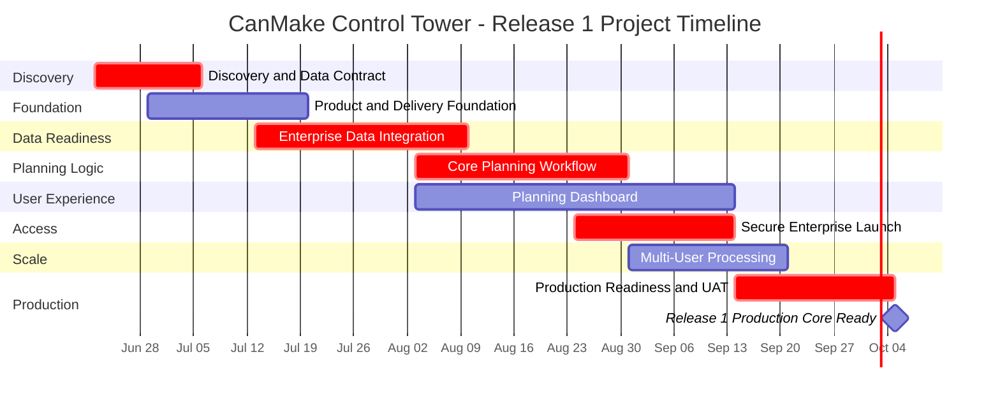
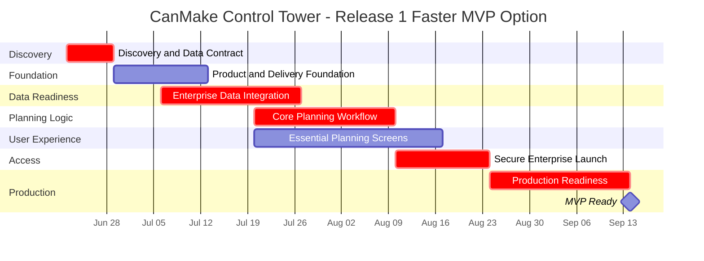
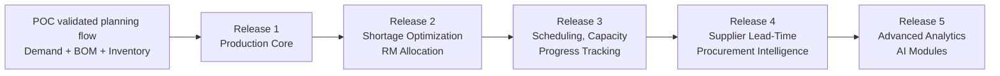

# CanMake Control Tower Proposal and Project Chart

**Manufacturing Feasibility and Planning Intelligence Platform**

This proposal summarizes the business value, implementation scope, delivery roadmap, project chart, staffing needs, risks, and success criteria for **CanMake Control Tower**.

## 1. Business Problem

C&S needs a production-grade planning cockpit that helps production, material planning, procurement, scheduling, sales, and management teams make faster and more reliable manufacturability decisions using enterprise planning data.

Today, planners need to evaluate finished goods feasibility by checking demand, BOM structure, raw material availability, packaging material availability, inventory, work orders, procurement status, and production constraints. This process is slow, often spreadsheet-driven, and depends heavily on manual interpretation.

As a result, teams face:

- Delayed feasibility checks.
- Inaccurate production commitments.
- Repeated re-planning.
- Emergency procurement.
- Idle capacity.
- Limited visibility across departments.

CanMake Control Tower will provide a centralized planning intelligence layer that converts business planning data into actionable feasibility, shortage, and production planning insights.

## 2. Business Questions CanMake Control Tower Will Answer

The system is designed to help answer:

- Which finished goods can be produced now?
- How many finished units can be produced from available stock?
- Which raw materials or packaging materials are blocking production?
- What is the minimum purchase required to maximize production?
- Which finished goods should be prioritized first?
- What happens if demand, inventory, procurement, or priority changes?
- Where are planning risks, production delays, supplier lead-time issues, and anomalies?

## 3. C&S Scope Summary

| Functional Area | Primary Owner | Priority | Business Intent |
| --- | --- | --- | --- |
| FG Manufacturability Analysis | Production Planner | High | Calculate how many finished goods can be built from existing stock and BOM availability. |
| RM Allocation and Freeze Controls | Material Planner | High | Reserve or freeze raw materials for planned production to avoid double allocation. |
| Advanced Production Scheduling and Capacity Planning | Scheduler Planner | High | Optimize production sequence, capacity usage, and sales visibility during low order booking. |
| Shortage Decision With Minimal Purchase | Production Planner | Medium | Identify shortages and recommend minimal purchase quantities to maximize production. |
| Production Order Progress Tracking | Production Scheduler | Medium | Track order completion, delays, WIP status, and plan-versus-actual progress. |
| Supplier Lead-Time Management | Material Planner | Medium | Incorporate actual supplier lead times and vendor performance into planning. |
| Integration and Data Synchronization | IT/ERP Integration Team | High | Keep enterprise planning data and CanMake Control Tower synchronized. |

## 4. POC Foundation

An initial proof of concept has validated the core planning approach for CanMake Control Tower. The POC is not a production system; it was used to confirm the feasibility of the planning logic and reduce delivery risk for Release 1.

The POC validation covered:

- Reads planning data from workbook input.
- Processes finished goods demand.
- Reads first-level process or BOM structure.
- Explodes demand into component requirements.
- Identifies purchasable or leaf components.
- Compares required quantities against available on-hand inventory.
- Calculates how much of each finished good can be produced.
- Identifies blocked finished goods and blocking components.
- Produces material shortage analysis.
- Produces production planning recommendations.
- Supports demand multiplier and what-if style procurement overrides.
- Provides downloadable outputs such as scenario summary, FG analysis, production plan, material shortages, material usage ranking, and planning report.
- Includes a planner assistant layer for answering planning questions from computed scenario results.

Validated planning flow:

```text
Demand + BOM + Inventory -> Feasibility -> Shortages -> Production Plan
```

Release 1 will convert this validated POC logic into production-ready modules that are modular, optimized, reusable, auditable, and suitable for multi-user business operations.

## 5. Production Gaps To Close

The POC validates the planning direction, but the production version needs enterprise readiness.

Key production gaps:

- Replace manual workbook upload with controlled enterprise data integration.
- Add a production web application experience for business users.
- Add secure launch and access control through the C&S enterprise environment.
- Add persistent scenario history and downloadable reports.
- Add multi-user processing for expected concurrent users.
- Add role-based access and auditability.
- Add private-server deployment and support readiness.
- Add allocation, reservation, scheduling, progress tracking, supplier intelligence, forecasting, risk, and anomaly modules across later releases.

## 6. Overall Production Target

CanMake Control Tower will be delivered as a private-server production planning cockpit in controlled releases.

### Release 1 Production Target

At a business level, Release 1 will deliver the core production cockpit:

- Users launch CanMake Control Tower from a dedicated button or menu option inside the C&S Oracle APEX environment.
- The launch option is visible only to users who are granted access by C&S.
- When an authorized user clicks the launch option, Oracle APEX creates a secure, short-lived launch authorization for that user and redirects the browser to CanMake Control Tower.
- CanMake Control Tower validates the launch authorization and opens the user session without requiring the user to sign in again.
- The system reads approved planning data directly from the C&S Oracle database in the agreed format and structure.
- Planners create and run manufacturability scenarios.
- Results are stored for history, reporting, and audit.
- Users view finished goods feasibility, shortages, blockers, and production recommendations.
- The system supports multiple users without blocking daily planning work.

### Later Release Expansion

After Release 1, the platform will expand into allocation, scheduling, supplier intelligence, forecasting, risk, anomaly detection, and advanced AI/ML modules.

### Release 1 Oracle APEX Launch and Data Integration

The proposed user flow is:

1. C&S prepares demand, BOM, inventory, and related planning data in the agreed database format.
2. The authorized user logs in to Oracle APEX using the existing C&S login process.
3. Oracle APEX shows a CanMake Control Tower button or menu option only to users who have been granted access.
4. The user clicks the CanMake Control Tower launch option.
5. Oracle APEX creates a secure, short-lived one-time launch code and redirects the user to CanMake Control Tower.
6. CanMake Control Tower validates the launch code, creates the user session, and opens without asking for a second login.
7. CanMake Control Tower reads the required planning data directly from the C&S Oracle database.
8. The user runs scenarios and views manufacturability, shortage, and production planning results.

This replaces the manual Excel upload workflow for the production system. Excel can still be used as a temporary support or testing format if needed, but it is not the intended Release 1 production workflow.

## 7. Release Roadmap

### Release 1: Core Manufacturability Platform

Goal:

Convert the validated POC manufacturability logic into a production-ready Release 1 workflow using enterprise planning data instead of manual workbook upload.

Scope:

- CanMake Control Tower branding.
- Production web application experience.
- Enterprise data integration for demand, BOM, inventory, and planning inputs.
- Oracle APEX launch button or menu option for authorized users.
- Secure one-time launch code validation and seamless user launch without a second login.
- Direct data fetch from the C&S Oracle database in the agreed format and structure.
- POC planning logic modularization, optimization, and production integration.
- FG manufacturability output.
- Material shortage output.
- Production plan output.
- Scenario run and scenario history.
- Report downloads.
- Private-server deployment.

Expected business outcome:

- 80 to 90 percent reduction in manual manufacturability validation time.
- Faster order commitment.
- More reliable production feasibility checks.
- Better visibility into blockers and shortages.

### Release 2: Shortage Optimization and RM Allocation

Goal:

Improve shortage decision-making and prevent double allocation of materials.

Scope:

- Minimal purchase recommendation to maximize output.
- RM/PM allocation view.
- Allocation conflict detection.
- Material reservation recommendation.
- Optional reservation or freeze control, subject to C&S approval.
- Procurement priority dashboard.
- Slow-moving or near-expiry material usage visibility if data is available.

Expected business outcome:

- Reduced unnecessary procurement.
- Better raw material utilization.
- Fewer last-minute RM/PM shortages.
- Reduced inter-department allocation conflicts.

### Release 3: Scheduling, Capacity, and Progress Tracking

Goal:

Expand CanMake Control Tower from manufacturability analysis into production execution visibility.

Scope:

- Work order and WIP status integration.
- Production order progress tracking.
- Plan-versus-actual dashboard.
- Delay and bottleneck visibility.
- Capacity calendar integration.
- Routing and resource loading view.
- Basic production sequence recommendation.
- Sales visibility during low order booking.

Expected business outcome:

- Better schedule adherence.
- Improved capacity utilization.
- Fewer shortage-driven reschedules.
- Faster customer commitment.

### Release 4: Supplier Lead-Time and Procurement Intelligence

Goal:

Use supplier performance and purchase data to improve planning reliability.

Scope:

- Supplier lead-time history.
- Expected receipt visibility.
- Supplier delay risk score.
- Lead-time variance dashboard.
- Material availability date estimation.
- Procurement exception alerts.

Expected business outcome:

- Fewer emergency purchases.
- More stable production plans.
- Better procurement planning accuracy.
- Improved working capital management.

### Release 5: Advanced Analytics and AI Modules

Goal:

Add advanced intelligence modules for forecasting, risk, anomaly detection, and planner assistance.

Scope:

- Demand forecasting.
- Inventory and demand anomaly detection.
- FG risk scoring.
- Material shortage risk scoring.
- Supplier delay prediction.
- Scenario recommendation engine.
- AI planner assistant using controlled business context.

Expected business outcome:

- Earlier risk visibility.
- Better demand-supply alignment.
- Improved planning decisions.
- Scalable foundation for additional plants or business units.

## 8. Release 1 Project Timeline

Estimated start date: Monday, 22 Jun 2026. Week 1 begins on that date. The expected Release 1 elapsed timeline is **3 to 4 months** using a parallel workstream delivery plan.



Release 1 target outcome:

```text
Production core ready by Week 13 to 16
```

## 9. Release 1 Faster MVP Option

If the team limits Release 1 to only core manufacturability, material shortages, scenario run, secure enterprise launch, required screens, and private-server deployment, the first production MVP may be delivered in:

```text
10 to 12 weeks
```



## 10. Release Dependency Chart



Estimated roadmap for the full C&S scope across all releases:

```text
6 to 9 months
```

## 11. Release 1 Development Phases and Time Estimate

The timeline below assumes structured C&S data is made available on time and the initial objective is a production-ready Release 1 platform for core manufacturability analysis. The duration column shows each phase inside the 3 to 4 month Release 1 delivery window, with overlapping workstreams where practical.

| Phase | Duration Within Release 1 | Main Activities | Key Deliverables |
| --- | ---: | --- | --- |
| Phase 0 - Discovery and Data Contract | Week 1 to 2 | Confirm Release 1 scope, review available data, define input/output expectations, confirm Oracle APEX launch flow, confirm user roles and deployment constraints | Final data contract, launch assumptions, delivery assumptions, Release 1 scope sign-off |
| Phase 1 - Product and Delivery Foundation | Week 2 to 4 | Product branding, application foundation, environment setup, logging, health checks, initial deployment preparation | Branded application foundation, initial configuration, base delivery structure |
| Phase 2 - Enterprise Data Integration | Week 4 to 8 | Read approved planning data from the C&S Oracle database, validate required fields, convert data into planning input format, create user-readable data quality messages | Data integration module, validation module, data readiness checks, test cases |
| Phase 3 - Core Planning Workflow | Week 7 to 10 | Integrate manufacturability engine, add scenario creation and run workflow, store inputs and outputs, generate planning results and reports | Scenario workflow, planning results, result history, report downloads, core test suite |
| Phase 4 - Planning Dashboard | Week 7 to 12 | Build demand overview, FG manufacturability, material shortage, production plan, scenario simulation, and report download screens | Production-ready planning dashboards, user workflow, reporting experience |
| Phase 5 - Secure Enterprise Launch | Week 10 to 13 | Enable Oracle APEX button/menu launch for authorized users, support seamless launch without second login, session handling, logout/session expiry, login audit trail | Secure launch flow, secure access handling, audit trail |
| Phase 6 - Multi-User Processing | Week 11 to 14 | Add background processing, job status tracking, scenario progress states, retry/failure handling, concurrency testing | Multi-user execution, job tracking, initial performance report |
| Phase 7 - Production Readiness and UAT | Week 13 to 16 | Configure private-server deployment, service operation, logs, backup expectations, UAT deployment and issue closure | Production deployment, operations guide, deployment guide, UAT sign-off package |

Release 1 total estimated time:

```text
3 to 4 months
```

## 12. Team Staffing and Allocation Plan

The first table below shows recommended staffing for Release 1. FTE means full-time equivalent, where `1.0` means full-time, `0.5` means half-time, and `0.2` means advisory or part-time support.

| Role | Recommended Allocation | Approx. Duration | Main Responsibility |
| --- | ---: | ---: | --- |
| Frontend Developer | 1.0 FTE | 12 to 16 weeks | Planning dashboards, scenario workflow, reports/download experience, user-facing states |
| Backend Developer | 1.0 FTE | 3 to 4 months | Data integration, planning workflow, scenario history, reports, access flow, multi-user processing |
| Data Scientist / AI Engineer | 0.2 FTE in Release 1 | 4 to 6 weeks in Release 1, larger role in later releases | Validate planning logic, support planner assistant, prepare future forecasting/risk/anomaly modules |
| QA Engineer | 0.5 FTE | 10 to 14 weeks | Functional testing, data validation testing, workflow testing, access testing, UAT support |
| DevOps Engineer | 0.3 FTE during build, 0.7 FTE during production readiness | 4 to 6 weeks total effort across project | Private-server setup, deployment readiness, logs, service operation, release support |
| Business Analyst / Project Coordinator | 0.3 FTE | 3 to 4 months | Requirement tracking, C&S coordination, UAT follow-up, sign-off management |
| C&S IT/Data Support | 0.2 to 0.4 FTE | 6 to 10 weeks | Data availability, access setup, launch coordination, validation support |

Release 1 phase-wise team allocation:

| Phase | Primary Team Allocation |
| --- | --- |
| Discovery and Data Contract | BA/Project Coordinator 0.3, C&S IT/Data 0.2, Backend 0.5 |
| Product and Delivery Foundation | Backend 1.0, Frontend 0.5, DevOps 0.3 |
| Enterprise Data Integration | Backend 1.0, C&S IT/Data 0.4, QA 0.3 |
| Core Planning Workflow | Backend 1.0, Data Scientist / AI Engineer 0.2, QA 0.5 |
| Planning Dashboard | Frontend 1.0, Backend 0.5, QA 0.5 |
| Secure Enterprise Launch | Backend 1.0, C&S IT/Data 0.4, DevOps 0.3 |
| Multi-User Processing | Backend 1.0, DevOps 0.5, QA 0.5 |
| Production Readiness and UAT | QA 0.5, DevOps 0.7, Backend 0.5, Frontend 0.5 |

Release 1 resource allocation matrix:

Legend: `1.0` = full-time, `0.5` = half-time, `0.2-0.4` = part-time support, `-` = not planned for that phase.

| Phase | Timeline | Backend | Frontend | Data Scientist / AI | QA | DevOps | BA / Coordinator | C&S IT/Data |
| --- | ---: | ---: | ---: | ---: | ---: | ---: | ---: | ---: |
| Discovery and Data Contract | Week 1 to 2 | 0.5 | - | - | - | - | 0.3 | 0.2 |
| Product and Delivery Foundation | Week 2 to 4 | 1.0 | 0.5 | - | - | 0.3 | 0.3 | - |
| Enterprise Data Integration | Week 4 to 8 | 1.0 | - | - | 0.3 | - | 0.3 | 0.4 |
| Core Planning Workflow | Week 7 to 10 | 1.0 | - | 0.2 | 0.5 | - | 0.3 | - |
| Planning Dashboard | Week 7 to 12 | 0.5 | 1.0 | - | 0.5 | - | 0.3 | - |
| Secure Enterprise Launch | Week 10 to 13 | 1.0 | - | - | - | 0.3 | 0.3 | 0.4 |
| Multi-User Processing | Week 11 to 14 | 1.0 | - | - | 0.5 | 0.5 | 0.3 | - |
| Production Readiness and UAT | Week 13 to 16 | 0.5 | 0.5 | - | 0.5 | 0.7 | 0.3 | - |

Data Scientist / AI Engineer release-wise allocation:

| Release | Recommended Allocation | Focus |
| --- | ---: | --- |
| Release 1 - Production Core | 0.2 FTE | Planning logic validation and controlled planner assistant support |
| Release 2 - Procurement and Allocation Intelligence | 0.2 FTE | Optimization support for shortage and allocation recommendations |
| Release 3 - Scheduling and Production Execution | 0.2 FTE | Scheduling logic support and production planning analytics |
| Release 4 - Supplier and Procurement Risk | 0.5 FTE | Supplier delay risk, lead-time variance, and procurement intelligence |
| Release 5 - Advanced AI/ML | 1.0 FTE | Forecasting, risk scoring, anomaly detection, and AI planner assistant |

Recommended core team for Release 1:

| Team Setup | Suggested Allocation |
| --- | --- |
| Minimum delivery team | 1 backend developer, 1 frontend developer, 0.5 QA, 0.3 DevOps, 0.2 Data Scientist / AI Engineer |
| C&S-side support needed | IT/data support, planning SME, production/material planning SME |
| Peak UAT support | Backend, frontend, QA, DevOps, and C&S SMEs available together during final 2 to 3 weeks |

## 13. Priority Matrix

| Module | POC Validation Status | Production Need | Recommended Priority |
| --- | --- | --- | --- |
| FG Manufacturability Analysis | Validated in POC | Modular, optimized, reusable production workflow with enterprise data input and scenario history | Release 1 |
| Material Shortage Analysis | Validated in POC | Modular shortage engine, reports, dashboards, and reusable result model | Release 1 |
| Production Plan Recommendation | Validated in POC | Production-grade planning workflow, result persistence, and user interface | Release 1 |
| Minimal Purchase Recommendation | Partially explored in POC | Optimization module and procurement recommendation workflow | Release 2 |
| RM Allocation and Freeze | Not covered in POC | Reservation logic and optional controlled write-back | Release 2 |
| Advanced Scheduling | Not covered in POC | Routing, capacity, calendar, sequencing logic | Release 3 |
| Production Progress Tracking | Not covered in POC | WIP and work order status integration | Release 3 |
| Supplier Lead-Time Management | Not covered in POC | Purchase and supplier history analytics | Release 4 |
| Integration and Data Sync | POC used workbook input only | Direct enterprise data integration and controlled updates | Release 1 onward |
| Forecasting | Not covered in POC | Historical demand model | Release 5 |
| Risk Analysis | Not covered in POC | Risk model and business rules | Release 5 |
| Anomaly Detection | Not covered in POC | Historical trend and anomaly model | Release 5 |

## 14. Team Workstreams

| Workstream | Responsibility |
| --- | --- |
| Backend and Planning Workflow | Data integration, planning engine adapter, scenario workflows, result storage, reports, access flow, background processing, logging |
| Frontend Experience | Layout, dashboards, scenario flow, data grids, charts, loading/empty/error states, report download experience |
| C&S Data and Launch Support | Input data readiness, launch coordination, access support, data validation, optional controlled updates |
| DevOps and Deployment | Private-server setup, service operation, logs, backups, release deployment, operations documentation |
| QA and UAT | Test data preparation, engine validation, workflow testing, access testing, performance testing, UAT issue tracking |

## 15. Key Risks and Dependencies

| Risk | Impact | Mitigation |
| --- | --- | --- |
| C&S data views not ready on time | Delays integration and testing | Finalize data contract early and use representative sample data until live data is ready. |
| Field mapping differs from the POC workbook format | Planning logic adjustment may be required | Keep a mapping layer between source data and planning logic. |
| Secure launch process needs C&S-side coordination | Access flow may be delayed | Confirm launch flow during discovery and involve C&S IT early. |
| Controlled write-back permissions not approved | Allocation freeze cannot be automated in Release 2 | Start with recommendation mode, add write-back after approval. |
| Heavy concurrent scenario runs | Slow user experience | Include multi-user processing and performance testing in Release 1. |
| Scheduling rules are complex | Release 3 may need longer validation | Deliver core feasibility first, then add scheduling in a controlled release. |
| Data quality issues | Incorrect recommendations | Add validation, exception reports, and data health checks. |

## 16. Release 1 Success Criteria

Release 1 should be considered successful when:

- Users can launch CanMake Control Tower from the C&S enterprise environment.
- Oracle APEX shows the CanMake Control Tower launch option only to authorized users.
- Authorized users can open CanMake Control Tower through secure one-time launch validation without signing in again.
- Users do not need to upload Excel files for the core production workflow.
- CanMake Control Tower reads approved demand, BOM, and inventory data directly from the C&S Oracle database in the agreed format and structure.
- Users can run a manufacturability scenario.
- Users can see finished goods feasibility.
- Users can see material shortages.
- Users can see production plan recommendations.
- Users can download required outputs.
- Scenario history is stored.
- Access is controlled and auditable.
- Around 50 users can use the system without major blocking.
- The system runs fully on the C&S private server.

## 17. Recommended Delivery Strategy

The recommended strategy is to deliver CanMake Control Tower in controlled releases:

1. **Release 1: Production Core**
   Convert the validated POC planning logic into modular, optimized, reusable production workflows using enterprise planning data.

2. **Release 2: Procurement and Allocation Intelligence**
   Add minimal purchase optimization and RM allocation/freeze controls.

3. **Release 3: Scheduling and Production Execution**
   Add work order progress, WIP visibility, capacity planning, and scheduling.

4. **Release 4: Supplier and Procurement Risk**
   Add supplier lead-time analytics and procurement delay risk.

5. **Release 5: Advanced AI/ML**
   Add forecasting, risk scoring, anomaly detection, and AI planner assistant.

This approach gives C&S early production value while keeping later scope organized into manageable releases.

## 18. Final Summary

CanMake Control Tower will be a private-server production planning cockpit for manufacturability, shortage visibility, production planning, and future planning intelligence. The POC has validated the core planning direction: demand, BOM, and inventory can be converted into feasibility, shortages, and production planning outputs.

The first production release should focus on making that validated logic modular, optimized, reusable, and production-ready, covering FG manufacturability, material shortages, production plan recommendations, scenario history, report downloads, secure enterprise launch, multi-user processing, and private-server readiness. Later releases should add RM allocation/freeze controls, minimal purchase optimization, advanced scheduling, production progress tracking, supplier lead-time intelligence, forecasting, risk analysis, and anomaly detection.
