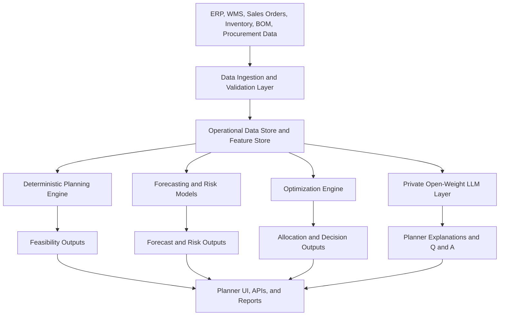
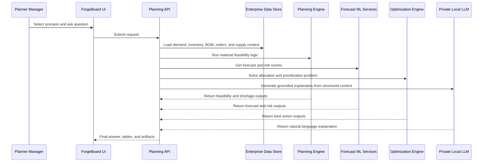
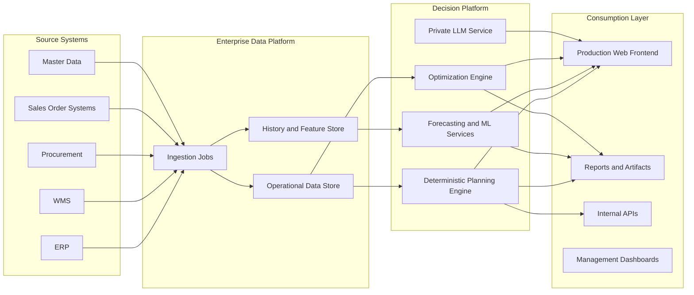
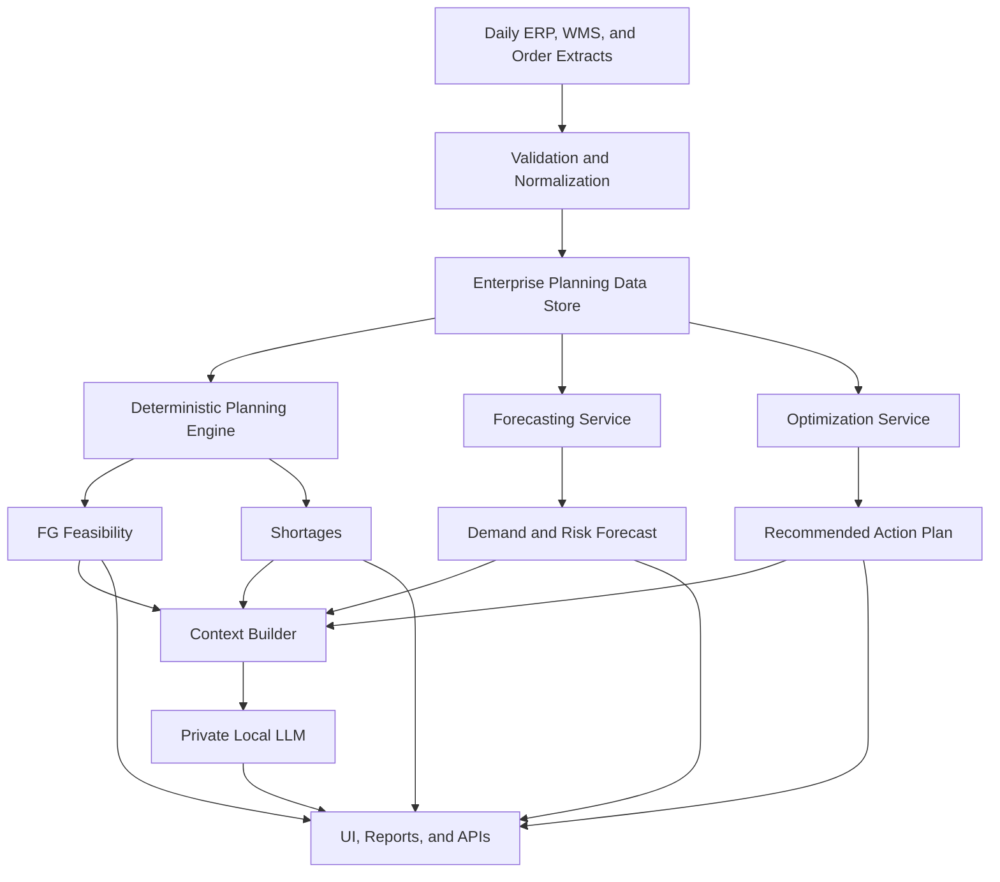

# C&S Electric AI Team Proposal

## Executive Summary

This proposal outlines a private, enterprise-grade AI and decision intelligence platform for C&S Electric.

The objective is not to replace ERP, WMS, or existing planning systems. The objective is to add a manufacturing intelligence layer that can:

- analyze demand, BOM, inventory, and procurement constraints
- calculate production feasibility across plants and warehouses
- predict shortages and operational risk
- optimize production and allocation decisions
- provide local, private, open-weight AI assistance for planners and management

This design is based on the current ForgeBoard planning engine and extends it into a scalable enterprise architecture suitable for a large factory network.

---

## 1. Client Context

C&S Electric scale assumptions provided for this proposal:

- more than `20` factories
- more than `50` warehouses
- average daily sales orders around `20,000`
- around `200,000` finished goods and related BOM structures
- private hosting requirement
- preference for locally downloaded open-weight models instead of closed-source hosted APIs

This scale changes the architecture significantly.

The correct design is:

- deterministic planning engine for material truth
- ML and optimization layer for prediction and decision support
- locally hosted open-weight LLMs for explanation and planner interaction

The LLM should **not** be the engine that performs core BOM, inventory, or production calculations.

---

## 2. Proposal Goals

The proposed platform should solve five business needs.

### 2.1 Production Feasibility

Answer:

- what can be produced now
- what is blocked
- which components are limiting
- what is the max producible quantity

### 2.2 Inventory and Procurement Intelligence

Answer:

- what materials are short
- what should be procured first
- which shortages have the widest business impact

### 2.3 Forecasting and Risk Prediction

Answer:

- where stockouts are likely to happen
- which items are demand-risky
- where procurement or supply risk is growing

### 2.4 Decision Optimization

Answer:

- how to allocate constrained inventory
- how to prioritize production across plants or warehouses
- how to maximize service level, margin, or critical order fulfillment

### 2.5 AI-Assisted Planning Experience

Answer:

- why an FG is blocked
- what changed in a scenario
- which order, material, or plant should be prioritized first
- what the planner should do next

### 2.6 Detailed Enterprise Problem Statements

This section explicitly includes the operational problem statements that a client AI team will expect for a large manufacturing network.

### 2.6.1 Production and FG Feasibility Problem Statements

| ID | Problem Statement | Business Question | Output | Current Scope Status |
|---|---|---|---|---|
| P1 | BOM-to-FG feasibility | With the current BOM and available inventory, how many units of each FG can be produced now? | max producible qty by FG | already aligned with current ForgeBoard foundation |
| P2 | FG demand coverage | For each FG demand, how much can be fully covered and what percent can be covered? | buildable qty, unmet qty, coverage percent | already aligned with current ForgeBoard foundation |
| P3 | limiting and blocking materials | Which components and subassemblies are reducing FG output? | limiting components, blocking components, shortage table | already aligned with current ForgeBoard foundation |
| P4 | shared inventory allocation | If multiple FGs compete for the same components, what is the best FG production plan? | recommended build plan across FGs | partially aligned, can be extended further |
| P5 | subassembly dependency | How do semi-finished or subassembly shortages reduce parent FG output? | dependency-aware blocker analysis | partially aligned, should be strengthened in enterprise version |
| P6 | plant-wise FG feasibility | At plant level, which FG can be built where? | plant-wise producibility matrix | requires plant-level enterprise data |

### 2.6.2 Sales Order Fulfillment Problem Statements

| ID | Problem Statement | Business Question | Output | Data Requirement |
|---|---|---|---|---|
| S1 | order fulfillment feasibility | With current stock and producible FG quantity, how many sales orders can be fully fulfilled? | fully fulfillable order count and order list | requires sales order header and line data |
| S2 | partial order fulfillment | If an order cannot be fulfilled fully, how much can still be delivered? | fulfillable quantity per order line | requires sales order line data |
| S3 | order fulfillment percentage | If an order is partially serviceable, what percent of the order can be fulfilled? | fill rate percent by order and line | requires sales order line data |
| S4 | order-level ATP or commit view | What can be promised today for each order? | order commit quantity and projected shortfall | requires order dates and allocation logic |
| S5 | unmet order risk | Which orders will remain short after current allocation? | unmet quantity, backlog, risk list | requires order allocation outputs |
| S6 | customer and SLA prioritization | Which orders should be fulfilled first based on SLA, criticality, margin, or penalties? | priority-ranked order list | requires customer and SLA attributes |

### 2.6.3 Network, Warehouse, and Plant Problem Statements

| ID | Problem Statement | Business Question | Output | Data Requirement |
|---|---|---|---|---|
| N1 | warehouse allocation | From which warehouse should each order be fulfilled? | order-to-warehouse allocation plan | requires warehouse stock and logistics rules |
| N2 | multi-plant allocation | Which plant should produce which FG when demand is shared across the network? | plant-to-FG production plan | requires plant capacity and plant stock data |
| N3 | stock balancing | Should stock be reallocated between warehouses or plants before procurement? | transfer recommendation list | requires transfer rules and logistics assumptions |
| N4 | dispatch optimization | Which available stock should be dispatched first to maximize service level? | dispatch priority plan | requires order due dates and dispatch rules |

### 2.6.4 Procurement, Risk, and Inventory Problem Statements

| ID | Problem Statement | Business Question | Output | Recommended Method |
|---|---|---|---|---|
| R1 | procurement prioritization | Which materials should be procured first to unlock the most FG or order fulfillment? | prioritized procurement list | deterministic + optimization |
| R2 | future stockout prediction | Which materials are likely to stock out in the next planning horizon? | stockout risk by material and date | forecasting + ML |
| R3 | supplier and lead-time risk | Which supply risks threaten production continuity? | supplier risk score and lead-time risk | tabular ML |
| R4 | dead stock and excess inventory | Which materials are overstocked, underused, or non-moving? | excess and dead-stock report | inventory analytics + ML |
| R5 | recurrent bottleneck materials | Which items repeatedly block production across many FGs or orders? | chronic bottleneck list | deterministic + historical analysis |
| R6 | anomaly detection | Which demand, BOM, or inventory patterns look abnormal and need review? | exception alerts | anomaly detection models |

### 2.6.5 Explicit Inclusion of the Questions You Mentioned

Yes, these problem statements are now explicitly included in the proposal.

#### A. With the current BOM, how many finished goods can be made?

Included as:

- `P1` BOM-to-FG feasibility
- `P2` FG demand coverage

Core output:

- FG code
- max producible quantity
- recommended build quantity
- unmet quantity
- coverage percent

#### B. How many sales orders can be fulfilled?

Included as:

- `S1` order fulfillment feasibility
- `S4` order-level ATP or commit view

Core output:

- fully fulfillable orders
- partially fulfillable orders
- unfulfillable orders

#### C. If not fully, how much can be fulfilled partially?

Included as:

- `S2` partial order fulfillment
- `S3` order fulfillment percentage

Core output:

- fulfillable quantity
- short quantity
- fulfillment percent

#### D. What priority should be used for orders and FGs?

Included as:

- `S6` customer and SLA prioritization
- `P4` shared inventory allocation
- `N2` multi-plant allocation
- `R1` procurement prioritization

Core output:

- order priority list
- FG priority list
- material procurement priority list

### 2.6.6 Key Planning Formulas

These formulas are important for client understanding.

#### FG max producible quantity

`Max Producible Qty = min(available component qty / qty required per FG)`

#### FG coverage percent

`FG Coverage % = recommended build qty / net demand qty * 100`

#### Sales order fulfillable quantity

`Order Fulfillable Qty = min(order qty, allocated available qty)`

#### Sales order fulfillment percent

`Order Fulfillment % = fulfillable qty / order qty * 100`

### 2.6.7 Important Scope Clarification

The current workbook-driven ForgeBoard foundation already supports the FG-level material feasibility problem family.

However, the full sales-order questions require additional enterprise data such as:

- sales order number
- sales order line number
- FG code on the order line
- order quantity
- requested date
- customer priority
- promised date
- warehouse allocation rules
- plant allocation rules

This means the proposal now includes those problem statements explicitly, but their implementation depends on integrating enterprise order and network data beyond the sample workbook.

---

## 3. Guiding Architecture Principle

The platform should be built on one strict principle:

`Deterministic engine for truth, ML for prediction, optimization for best action, LLM for explanation.`

This separation is important because:

- manufacturing calculations must remain exact and auditable
- forecasting models should be trained on historical data, not prompted ad hoc
- optimization decisions should be solved mathematically
- LLMs should help users understand, query, and communicate the results

---

## 4. Solution Overview

### 4.1 Core Platform Layers

### 4.2 High-Level Operating Model

---

## 5. Component-by-Component Solution Design

## 5.1 Data Ingestion Layer

### Purpose

Collect and normalize data from enterprise systems.

### Inputs

- sales orders
- order lines
- FG demand
- BOM master
- subassembly structures
- plant inventory
- warehouse inventory
- purchase orders
- planned receipts
- supplier master
- lead times
- item master
- plant and warehouse master

### Recommended implementation

- batch ingestion from ERP and WMS exports initially
- later move to API or message-based integration
- strong data validation before planning run

### Key outputs

- clean demand tables
- clean inventory tables
- normalized BOM structures
- historical time-series datasets for forecasting

---

## 5.2 Deterministic Planning Engine

### Purpose

Calculate planning truth.

### Responsibilities

- BOM explosion
- component requirement calculation
- inventory matching
- shortage calculation
- max producible quantity
- FG and material criticality views
- plant-wise and warehouse-wise feasibility

### Why deterministic

This layer must remain auditable and explainable.

### Recommended implementation

- continue with ForgeBoard core logic as foundation
- extend to order-level and network-level planning
- expose through API service for UI and downstream systems

---

## 5.3 Forecasting and Predictive Layer

### Purpose

Predict future demand, shortage risk, and procurement pressure.

### Business scenarios

- demand forecasting by FG, family, plant, warehouse, channel, or customer segment
- stockout prediction
- lead-time disruption risk
- abnormal consumption detection
- procurement recommendation scoring

### Recommended model stack

| Problem | Recommended First Models | Notes |
|---|---|---|
| demand forecasting | `StatsForecast` | best first choice for many industrial series at scale |
| risk / shortage prediction | `LightGBM`, `XGBoost` | strong for tabular enterprise data |
| anomaly detection | `Isolation Forest` | simple and practical baseline |
| advanced deep forecasting | `NeuralForecast` (`NHITS`, `TFT`, `PatchTST`) | use only for selected high-value groups initially |

### Recommended rollout order

1. `StatsForecast` for baseline time-series forecasting
2. `LightGBM/XGBoost` for shortage and procurement risk
3. `NeuralForecast` only for focused use cases where extra complexity is justified

### Why not start with deep learning for everything

Because the scale is very large and industrial demand is often sparse, seasonal, intermittent, and hierarchy-heavy.

A practical industrial rollout should begin with:

- statistical forecasting
- strong tabular ML
- selective deep learning later

---

## 5.4 Optimization Layer

### Purpose

Turn scenario outputs into best-action plans.

### Business scenarios

- constrained FG production allocation
- plant-wise allocation
- warehouse fulfillment allocation
- procurement prioritization
- service-level or margin-aware order prioritization
- substitution or alternate-material decisions

### Recommended implementation

- `OR-Tools`
- linear programming / mixed-integer programming depending on complexity

### Why optimization is required

Prediction does not tell the planner what to do.

Optimization answers:

- which FG to build first
- how much to allocate to each order, plant, or warehouse
- which action gives the best business outcome under constraints

---

## 5.5 Private LLM Layer

### Purpose

Provide local, private, open-weight natural-language interaction.

### Important rule

The LLM should not process the full raw enterprise dataset.

The LLM should receive:

- summarized scenario context
- selected FG details
- shortage summaries
- ranked recommendations
- forecast outputs
- optimization outputs

### Recommended model strategy

| Role | Recommended Model | Why |
|---|---|---|
| primary enterprise assistant | `Qwen3-32B` | strong reasoning, multilingual, Apache 2.0 |
| fast assistant / fallback | `Mistral-Small-24B-Instruct-2501` | lower latency, strong instruction following |
| optional harder reasoning path | `DeepSeek-R1-14B` or `32B` | useful for complex planner analysis, slower |

### Recommended runtime

- `vLLM` for enterprise inference serving
- local downloaded model weights inside private infrastructure

### Recommended private LLM infrastructure tiers

| Tier | When to use | CPU | System RAM | GPU | Storage | Best-fit local models |
|---|---|---:|---:|---|---:|---|
| minimal workable | controlled pilot, low concurrency, internal evaluation | `16-24 cores` | `128 GB` | `1 x 48 GB GPU` | `1-2 TB NVMe` | `Qwen3-14B`, quantized `Mistral-Small-24B` |
| good / recommended | real production pilot, multiple planners, stable daily use | `32 cores` | `256 GB` | `2 x 48 GB GPU` or `1 x 80 GB GPU` | `2 TB NVMe` | `Qwen3-32B`, `Mistral-Small-24B`, optional secondary model |
| best / enterprise | high concurrency, multi-site usage, routed multi-model architecture | `48-64 cores` | `512 GB` | `2 x 80 GB GPU` or `4 x 48 GB GPU` | `4 TB NVMe` | `Qwen3-32B` plus secondary reasoning or specialist models |

Important sizing rule:

- GPU memory determines whether the model fits and how fast it runs
- system RAM determines whether the node stays stable under concurrent enterprise usage

### Why not use Ollama as the enterprise standard

Ollama is good for experimentation and small internal deployments.

For this scale, the better production choice is:

- stronger scheduling
- more control over GPU utilization
- better concurrency management
- clearer enterprise inference architecture

That is why `vLLM` is the better recommendation for production.

### Privacy position

- all weights downloaded into private environment
- no closed-source hosted API dependency
- no external prompt/data transfer for inference
- LLM confined to internal network

---

## 6. Recommended Enterprise Architecture

---

## 7. Infrastructure Proposal

## 7.1 Deployment Principle

For C&S Electric, infrastructure should be separated into distinct compute domains.

### Separate domains

1. application and API layer
2. database and historical data layer
3. ML and forecasting layer
4. local LLM GPU inference layer

This avoids mixing:

- operational APIs
- heavy analytics
- GPU inference
- training workloads

---

## 7.2 Proposed Production Infrastructure

### A. App / Planning API Layer

| Component | Qty | Recommended Spec | Purpose |
|---|---:|---|---|
| app server | 2 | `16 vCPU`, `64 GB RAM`, `1 TB NVMe` | UI, API, planning orchestration |
| reverse proxy / LB | 1 | managed or dedicated | HTTPS, routing, failover |

### B. Database / Storage Layer

| Component | Qty | Recommended Spec | Purpose |
|---|---:|---|---|
| primary DB server | 1 | `32 vCPU`, `256 GB RAM`, `4 TB NVMe` | operational planning data |
| replica DB server | 1 | same or slightly smaller | HA / reporting / backup |
| object storage | 1 logical service | scalable | workbook uploads, exports, artifacts |

### C. Forecasting / ML Layer

| Component | Qty | Recommended Spec | Purpose |
|---|---:|---|---|
| ML compute server | 1-2 | `32 vCPU`, `128 GB RAM`, `2 TB NVMe` | forecasting, feature jobs, risk scoring |
| optional GPU for DL | 1 | `L4` / `A30` / similar | only if deep forecasting is adopted |

### D. Private LLM Layer

| Tier | Qty | Recommended Spec per Node | Purpose |
|---|---:|---|---|
| minimal workable | `1` | `16-24 CPU cores`, `128 GB RAM`, `1-2 TB NVMe`, `1 x 48 GB GPU` | controlled pilot and low-concurrency local LLM usage |
| good / recommended | `2` | `32 CPU cores`, `256 GB RAM`, `2 TB NVMe`, `2 x 48 GB GPU` or `1 x 80 GB GPU` | production pilot and multi-user planner assistance |
| best / enterprise | `2-4` | `48-64 CPU cores`, `512 GB RAM`, `4 TB NVMe`, `2 x 80 GB GPU` or `4 x 48 GB GPU` | high-concurrency, multi-site enterprise inference |

### Recommended GPU choices

- `RTX 6000 Ada 48GB`
- `L40S 48GB`
- `H100 80GB` or similar enterprise accelerator for higher-end configurations

### Why two LLM servers

- resilience
- maintenance without full outage
- multi-user concurrency
- cleaner scaling path

---

## 7.3 Pilot Infrastructure

If the client wants to start with a controlled pilot first:

| Layer | Recommended Pilot Spec |
|---|---|
| app server | `8 vCPU`, `32 GB RAM`, `500 GB NVMe` |
| DB server | `16 vCPU`, `64 GB RAM`, `1 TB NVMe` |
| ML server | `16 vCPU`, `64 GB RAM`, `1 TB NVMe` |
| LLM server | `16-24 CPU cores`, `128 GB RAM`, `1 x 48 GB GPU`, `1-2 TB NVMe` |

### Pilot model recommendation

- `Qwen3-14B` or `Qwen3-32B`
- `Mistral-Small-24B-Instruct-2501` if lower latency is required

---

## 8. Software Stack Recommendation

## 8.1 Core Platform

| Layer | Recommended Stack |
|---|---|
| web UI | `Next.js` + `React` + `TypeScript` + `MUI` or `Ant Design` + `AG Grid` |
| frontend state and data layer | `TanStack Query`, typed API clients, form validation layer |
| API layer | `FastAPI` with internal BFF or API gateway pattern |
| planning engine | Python services based on ForgeBoard core |
| data processing | Pandas / Polars / SQL jobs |
| database | PostgreSQL or enterprise SQL standard |
| object storage | MinIO / S3-compatible private storage |
| job orchestration | Airflow / Prefect / enterprise scheduler |
| monitoring | Prometheus + Grafana / enterprise standard |
| logging | ELK / OpenSearch / enterprise SIEM |

## 8.2 ML and Optimization

| Problem Type | Tooling |
|---|---|
| forecasting | `StatsForecast`, `NeuralForecast` |
| tabular prediction | `LightGBM`, `XGBoost` |
| optimization | `OR-Tools` |
| anomaly detection | `scikit-learn`, `PyOD` |
| feature engineering | SQL + Python pipelines |

## 8.3 Private LLM Stack

| Layer | Recommended Choice |
|---|---|
| model registry | internal artifact or model registry |
| inference runtime | `vLLM` |
| orchestration | internal service wrapper |
| embeddings if later needed | local open embedding model |
| prompt grounding | structured JSON context from engine |

---

## 9. Use-Case-to-Technology Mapping

| Business Need | Recommended Method | Why |
|---|---|---|
| BOM feasibility | deterministic engine | exact, auditable |
| shortage identification | deterministic engine | exact, auditable |
| production ranking | rules + optimization | action-oriented |
| stockout prediction | ML | history-based prediction |
| procurement prioritization | ML + optimization | impact and best-action view |
| planner explanation | local LLM | natural interaction |
| management summary | LLM over structured outputs | fast communication |
| anomaly detection | ML | pattern-based exception detection |

---

## 10. Data Flow for an Enterprise Planning Run

---

## 11. Security and Governance Requirements

For a large industrial client, the AI platform should include:

- private network deployment
- local model weights only
- no public prompt routing
- role-based access control
- audit logging for scenario runs
- model usage logging
- artifact retention policy
- environment separation for dev, UAT, and prod
- backup and DR policy
- approval process for model/version upgrades

### Recommended environment separation

| Environment | Purpose |
|---|---|
| dev | development and model experimentation |
| UAT | business validation and scenario testing |
| prod | live planning usage |

---

## 12. AI Model Governance Recommendation

The client wants open-weight local models.

That requires governance in four areas.

### 12.1 Model Approval

- approved model list
- approved quantization strategy
- approved runtime version

### 12.2 Prompt and Context Control

- only structured planner context should reach the LLM
- no full raw ERP dump in prompts
- sensitive fields should be masked where required

### 12.3 Response Safety

- LLM answers should always be grounded in deterministic outputs
- planner assistant should fall back safely when confidence is low
- recommendations should expose source metrics and rationale

### 12.4 Model Lifecycle

- model versioning
- rollback capability
- benchmark validation before production promotion

---

## 13. Proposed Delivery Roadmap

## Phase 1: Planning Foundation

Scope:

- demand + BOM + inventory ingestion
- deterministic feasibility engine
- shortage views
- FG prioritization
- exports and reports

Outcome:

- current ForgeBoard-style production feasibility platform

## Phase 2: Enterprise Data Integration

Scope:

- ERP / WMS integration
- database-backed scenario layer
- history retention
- API exposure

Outcome:

- stable enterprise planning data foundation

## Phase 3: Forecasting and Risk Intelligence

Scope:

- demand forecasting
- stockout risk
- procurement risk
- anomaly detection

Outcome:

- predictive planning capability

## Phase 4: Optimization and Network Decisioning

Scope:

- constrained allocation
- multi-plant planning
- warehouse fulfillment decisions
- service-level and margin-aware optimization

Outcome:

- best-action planning recommendations

## Phase 5: Private AI Assistant

Scope:

- local open-weight model deployment
- grounded planner Q&A
- management summary generation
- scenario comparison explanation

Outcome:

- natural-language planning assistant inside private infrastructure

---

## 13A. Timeline by Phase

The timeline below is a proposal-level estimate for phased delivery.

It assumes:

- reasonable client-side data availability
- working access to business users for validation
- no major ERP integration blockers
- phased implementation rather than big-bang delivery

| Phase | Scope | Estimated Duration | Key Deliverables |
|---|---|---|---|
| Phase 1 | planning foundation | `6-8 weeks` | BOM feasibility engine, shortage logic, FG coverage, base reports, initial UI |
| Phase 2 | enterprise data integration | `8-12 weeks` | ERP/WMS ingestion, database-backed scenario layer, order and inventory integration APIs |
| Phase 3 | forecasting and risk intelligence | `8-10 weeks` | demand forecast, stockout prediction, procurement risk scores, anomaly alerts |
| Phase 4 | optimization and allocation | `8-12 weeks` | order allocation, FG prioritization, warehouse and plant recommendation logic |
| Phase 5 | private AI assistant | `6-8 weeks` | local open-weight LLM deployment, grounded planner assistant, management summary workflows |
| Phase 6 | hardening and rollout | `4-6 weeks` | UAT, security hardening, monitoring, DR, production rollout support |

### Overall Program Estimate

Depending on integration complexity, a practical enterprise rollout is typically:

- `9 to 12 months` for a strong production implementation
- faster if done as a narrower pilot first

### Recommended delivery strategy

- start with a narrow pilot across selected plants or product families
- validate feasibility and fulfillment logic first
- then expand into forecasting, optimization, and private AI assistance

---

## 13B. CAPEX-Style Hardware BOM Table

This section provides a client-facing hardware bill of materials for private deployment.

Important note:

- this is an infrastructure sizing BOM, not a manufacturing BOM
- prices are intentionally left as `TBD by OEM / partner / cloud equivalent` because actual cost depends on vendor, region, support contract, and procurement policy

### Option A: Pilot Hardware BOM

| Item | Qty | Suggested Specification | Purpose | Unit Cost | Total Cost |
|---|---:|---|---|---|---|
| app server | `1` | `8 vCPU`, `32 GB RAM`, `500 GB NVMe` | frontend, API, planning orchestration | `TBD` | `TBD` |
| database server | `1` | `16 vCPU`, `64 GB RAM`, `1 TB NVMe` | planning data, history, reporting | `TBD` | `TBD` |
| ML server | `1` | `16 vCPU`, `64 GB RAM`, `1 TB NVMe` | forecasting jobs and risk models | `TBD` | `TBD` |
| LLM server | `1` | `16-24 CPU cores`, `128 GB RAM`, `1 x 48 GB GPU`, `1-2 TB NVMe` | local private LLM inference | `TBD` | `TBD` |
| object storage | `1 logical service` | private object storage / NAS / MinIO | artifacts, uploads, exports | `TBD` | `TBD` |
| network and security | `1 set` | firewall, TLS, access controls | secure internal deployment | `TBD` | `TBD` |

### Option B: Recommended Production Hardware BOM

| Item | Qty | Suggested Specification | Purpose | Unit Cost | Total Cost |
|---|---:|---|---|---|---|
| app server | `2` | `16 vCPU`, `64 GB RAM`, `1 TB NVMe` | production frontend/API and planning services | `TBD` | `TBD` |
| load balancer / reverse proxy | `1` | enterprise or managed | routing, TLS, HA | `TBD` | `TBD` |
| primary DB server | `1` | `32 vCPU`, `256 GB RAM`, `4 TB NVMe` | core operational planning store | `TBD` | `TBD` |
| replica DB server | `1` | same or slightly smaller | HA and reporting | `TBD` | `TBD` |
| ML server | `1-2` | `32 vCPU`, `128 GB RAM`, `2 TB NVMe` | forecasting, features, scoring | `TBD` | `TBD` |
| LLM inference server | `2` | `32 CPU cores`, `256 GB RAM`, `2 TB NVMe`, `2 x 48 GB GPU` or `1 x 80 GB GPU` | multi-user local LLM inference | `TBD` | `TBD` |
| object storage | `1 logical service` | MinIO / NAS / S3-compatible private storage | artifacts, datasets, model files | `TBD` | `TBD` |
| monitoring and logging stack | `1 set` | Prometheus, Grafana, logging stack | observability and operations | `TBD` | `TBD` |
| backup and DR storage | `1 set` | backup target and recovery storage | resilience and compliance | `TBD` | `TBD` |

### Option C: Best Enterprise Hardware BOM

| Item | Qty | Suggested Specification | Purpose | Unit Cost | Total Cost |
|---|---:|---|---|---|---|
| app server | `2-4` | `16-32 vCPU`, `64-128 GB RAM`, `1 TB NVMe` | high-availability application services | `TBD` | `TBD` |
| API gateway / load balancer | `1-2` | enterprise-grade | secure routing and API management | `TBD` | `TBD` |
| primary DB cluster node | `1` | `32-64 vCPU`, `256-512 GB RAM`, `4-8 TB NVMe` | core enterprise planning datastore | `TBD` | `TBD` |
| replica / DR DB node | `1-2` | similar class | resilience and failover | `TBD` | `TBD` |
| ML compute node | `2` | `32-64 vCPU`, `128-256 GB RAM`, `2-4 TB NVMe` | forecasting, scoring, retraining, feature pipelines | `TBD` | `TBD` |
| LLM inference node | `2-4` | `48-64 CPU cores`, `512 GB RAM`, `4 TB NVMe`, `2 x 80 GB GPU` or `4 x 48 GB GPU` | enterprise private LLM inference at scale | `TBD` | `TBD` |
| object storage cluster | `1 logical service` | scalable enterprise storage | models, artifacts, exports, retained files | `TBD` | `TBD` |
| monitoring, logging, backup, security stack | `1 set` | enterprise operations stack | observability, backup, audit, compliance | `TBD` | `TBD` |

### Hardware BOM Notes

Use this table for client planning, not as a final purchase order.

Final procurement depends on:

- OEM or SI partner choice
- GPU availability
- on-prem vs private cloud strategy
- HA and DR policy
- security and compliance standards
- support and warranty requirements

### How to Position This to the Client

You can say:

`We are providing a sizing-oriented hardware BOM so the infrastructure team can plan capacity and procurement early. Final pricing should be obtained from the preferred OEM, system integrator, or cloud platform based on the approved architecture and support model.`

---

## 14. Risks and Mitigations

| Risk | Impact | Mitigation |
|---|---|---|
| poor source data quality | inaccurate recommendations | strong ingestion validation and master-data checks |
| trying to use LLM for core planning truth | low reliability | keep deterministic engine as source of truth |
| under-sized GPU infrastructure | slow assistant | separate dedicated inference servers |
| too much deep learning too early | long delivery time | start with statistical forecasting and tabular ML |
| no model governance | inconsistent outputs | approval and version control process |
| no persistence layer | poor auditability | add database-backed run history |

---

## 15. Recommended Starting Point for C&S Electric

If the client wants the most practical first step, recommend this:

### Recommended Phase-1-to-Phase-3 foundation

- deterministic planning engine based on ForgeBoard
- enterprise data store
- forecasting stack with `StatsForecast` + `LightGBM/XGBoost`
- optimization stack with `OR-Tools`
- private local open-weight LLM layer with `Qwen3-32B`
- `vLLM` runtime on dedicated GPU servers

### Why this is the best first architecture

- industrially practical
- private and security-aligned
- scalable beyond workbook mode
- avoids overusing LLMs where exact logic is required
- supports future predictive and optimization use cases

---

## 16. Final Recommendation

You can present the final architecture message like this:

`For C&S Electric, the correct AI platform is not a chatbot over Excel. It should be a private manufacturing intelligence platform built on deterministic planning, enterprise forecasting, mathematical optimization, and local open-weight AI models. The planning engine should calculate the truth, ML should predict future risk, optimization should recommend best actions, and the local LLM should explain the result to planners and management in natural language.`

---

## 17. Short Client Pitch

`We recommend building C&S Electric's AI planning platform as a private enterprise solution. The core planning engine will perform exact BOM, inventory, and production feasibility calculations. Forecasting and risk models will predict future shortages and demand pressure. Optimization models will recommend the best operational action under constraints. A locally hosted open-weight LLM such as Qwen3-32B will run entirely inside the client's infrastructure to provide secure planner assistance, explanations, and management summaries. This gives C&S Electric an auditable, scalable, and future-ready AI architecture rather than a fragile chatbot layer.`
